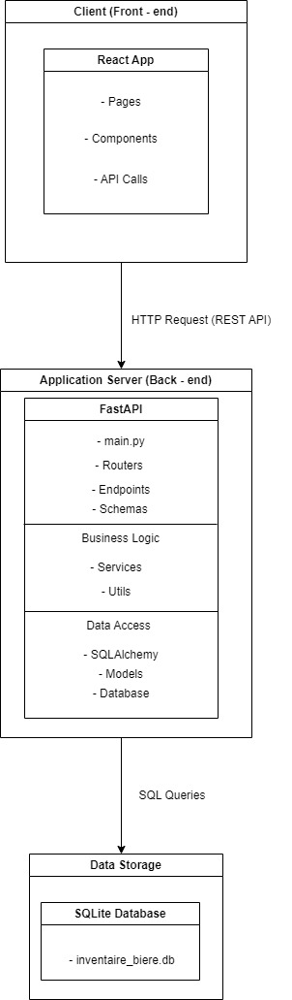

# ARCHITECTURE N-TIERS

## Diagramme d'Architecture


## Explications de l'Architecture

### Client (Front-end)
L'application frontend est développée avec React et est située dans le dossier `frontend`.

#### Composants
- **Pages**: Composants de niveau supérieur représentant des vues complètes.
- **Components**: Composants réutilisables.
- **API Calls**: Requêtes HTTP vers l'API backend pour interagir avec les données.

### Application Server (Back-end)
Le backend est développé avec FastAPI et est situé dans le dossier `backend/app`.

#### FastAPI
- **main.py**: Le point d'entrée de l'application FastAPI.
- **api**: Gestion des routes et des endpoints.
- **Endpoints**: Fonctions définissant les routes API.
- **Schemas**: Définition des schémas Pydantic pour la validation des données.

#### Business Logic
- **Services**: Fonctions qui implémentent la logique métier.
- **Utils**: Fonctions utilitaires, comme le hachage des mots de passe.

#### Data Access
- **SQLAlchemy**: ORM utilisé pour interagir avec la base de données.
- **Models**: Modèles de données SQLAlchemy.
- **Database**: Configuration et gestion de la session de base de données.

### Data Storage
La base de données SQLite est située dans le dossier `data`.

- **inventaire_biere.db**: Le fichier de données SQLite.


## Installation et Configuration

### Prérequis
- Python 3.8+
- Node.js
- npm (ou yarn)

Clonez le projet :
```
git clone https://github.com/Ximawa/Archi.git
```

### BDD
Creation de la bdd et peuplage
```
cd Archi
py database/init_db.py
```

### Backend

Accédez au répertoire backend :
```
cd Archi/backend
```

Installez les dépendances :
```
pip install -r requirements.txt
```

Lancez le serveur :
```
uvicorn app.main:app
```

### Frontend
Accédez au répertoire frontend/bar-app :
```
cd frontend/bar-app
```

Installez les dépendances :
```
npm install
```

Démarrez l'application :
```
npm run start
```

## Utilisation

### Accéder à l'application

Frontend: Ouvrez http://localhost:3000 dans votre navigateur.
Backend: La documentation de l'API est disponible à http://localhost:8000/docs.

### Comptes utilisateurs

Patron
```
username : Patron
pswd : wiwi
```

Barman
```
username : Barman
pswd : barman
```